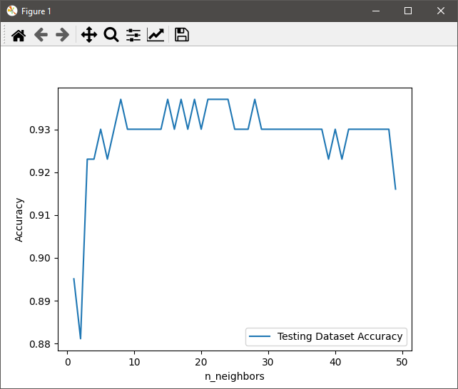
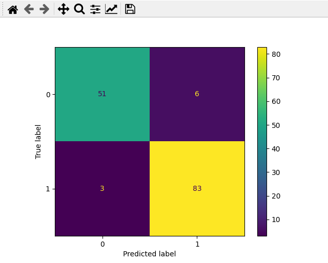
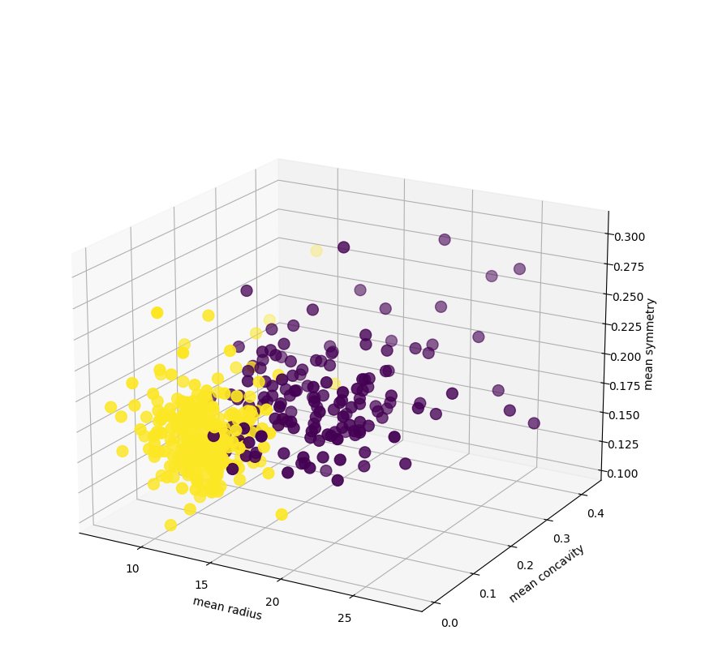
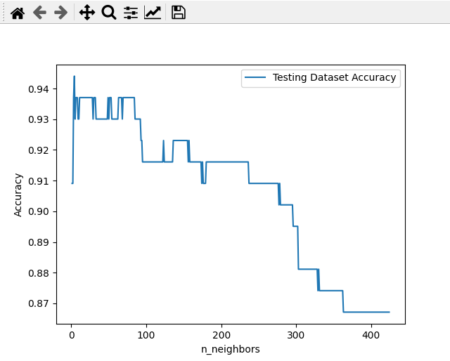

## Machine Learning: Project 1

### Alex Karwowski

### Group 6

---

- [Background](#background)
- [Statistical Summary](#statistical-summary)
- [Summary of Classification Results](#summary-of-classification-results)
- [Distance Metric](#distance-metric)
- [Best K, Worst K](#best-k-worst-k)
- [Data Leakage](#data-leakage)
- [A Brief Look at Code](#a-brief-look-at-code)
- [Conclusion](#conclusion)
- [References](#references)

---

# Background

Features are computed from a digitized image of a fine needle aspirate (FNA) of a breast mass. They describe characteristics of the cell nuclei present in the image.

Separating plane described above was obtained using Multisurface Method-Tree (MSM-T), a classification method which uses linear programming to construct a decision tree. Relevant features were selected using an exhaustive search in the space of 1-4 features and 1-3 separating planes.

There are 30 different features to help the algorithm decided on the appropriate classification. Theres 30 features are broken up into 3 subclasses of 10 features each. The features include the following:

`mean radius' 'mean texture' 'mean perimeter' 'mean area'
 'mean smoothness' 'mean compactness' 'mean concavity'
 'mean concave points' 'mean symmetry' 'mean fractal dimension'
 'radius error' 'texture error' 'perimeter error' 'area error'
 'smoothness error' 'compactness error' 'concavity error'
 'concave points error' 'symmetry error' 'fractal dimension error'
 'worst radius' 'worst texture' 'worst perimeter' 'worst area'
 'worst smoothness' 'worst compactness' 'worst concavity'
 'worst concave points' 'worst symmetry' 'worst fractal dimension'`

There are also two classifications that the algorithm can choose from. Those two classifications are `'Malignant'` or `'Benign'`

---

# Statistical Summary

The results below come directly from our testing of the k nearest neighbors algorithm on our dataset.


```python
Features & Attributes (Total): 30
Features & Attributes (Type): [
    'mean radius' 'mean texture' 'mean perimeter' 'mean area'
    'mean smoothness' 'mean compactness' 'mean concavity'
    'mean concave points' 'mean symmetry' 'mean fractal dimension'
    'radius error' 'texture error' 'perimeter error' 'area error'
    'smoothness error' 'compactness error' 'concavity error'
    'concave points error' 'symmetry error' 'fractal dimension error'
    'worst radius' 'worst texture' 'worst perimeter' 'worst area'
    'worst smoothness' 'worst compactness' 'worst concavity'
    'worst concave points' 'worst symmetry' 'worst fractal dimension'
]
Number of Classes: ['malignant' 'benign']
Distribution of Classes: {'malignant': 212, 'benign': 357}
Dataset Partition (Training): 75.5%
Dataset Partition (Testing): 24.5%
Distance Metric: euclidean
Estimate Accuracy at 5 Nearest Neighbors: 0.923
Estimate Accuracy at 15 Nearest Neighbors: 0.93
Estimate Accuracy at 30 Nearest Neighbors: 0.93
Estimate Accuracy at 50 Nearest Neighbors: 0.916
Min: 0.881
Max: 0.937
Mean: 0.929
Median: 0.93
Mode: 0.93
STD: 0.009
```
<center>

 

</center>

<center> Figure 1 </center>

Some things we can extrapolate from this data is the following:

* Our highest accuracy was 5 nearest neighbors at 94.4%
* Between 15 and 28 Nearest neighbors gave us the highest *consistent* accuracy
* After 30 Nearest Neighbors the accuracy started to fall
* Our highest accuracy was 93.7%
* In all 50 nearest neighbors our minimum accuracy was 88.1 
* In a test of 425 nearest neighbors, it showed that as the k number increased past 50, the accuracy took steep losses up to the point where at 300 nearest neighbors, the accuracy was 86.7% which is still high but not as accurate as the 93-94% with lower numbers

---

# Summary of Classification Results

We found out that after a certain point checking more neighbors had diminishing returns for accuracy. This makes sense because as the number of neighbors your checking increases, the chances that you start getting more and more false positives and false negatives increases as well.

Based on our Confusion Matrix Generated, we had an accuracy of 93.7% with minimal false negatives and a very small amount of false positives.

<center>



</center>

<center> Figure 2 </center>

---

# Distance Metric

For the distance metric sklearn used the manhattan distance. This allowed us to better predict classes with many features/attributes and allowed us to do classification weighted by the distance instead of uniformity.

<center>



</center>
<center> Figure 3 </center>

---

# Best K, Worst K

Our best K was `5` nearest neighbors while our worst K was anything after `50`. In the case where we did 425 nearest neighbors (shown below), after about 212 nearest neighbors it started to drop in accuracy quite significantly. Therefor any additional nearest neighbors would give out more false positives or false negatives.

<center>



</center>

<center> Figure 4 </center>
Accuracy is a measure of how well our training results worked compared to our test results.


*As a side note, our accuracy at 0 nearest neighbors was higher than 1 nearest neighbors which I assume was due to luck and randomness in the data set.*

---

# Data Leakage

Data leakage is when you test a model on the same data you train it off of. This can lead to higher scores and many false positives because it is testing based of the same data trained. If it trains on a point and it "re sees" that point in the testing, you will have a confirmation bias on the model.

I do not think we experienced any data leakage problems with our data set. We started with the initial dataset and then split them up into a training and testing data set, so from there there was no overlap of data points to cause data leakage. 

---

# A Brief Look at Code

```python
#Load the data into an object
breastData = load_breast_cancer(as_frame=True)

#Split up the data
x = breastData.data
y = breastData.target

#Split The data into training and testing arrays
x_train, x_test, y_train, y_test = train_test_split(x, y, train_size=.75, random_state=20)

#Set np arrays for training, testing, and neighbors
neighbors = np.arange(1,50)
train_acc = np.empty(len(neighbors))
test_acc = np.empty(len(neighbors))

#Run through testing for each k number of neighbors
for i,k in enumerate(neighbors):
    #Training
    #Setting the metric to minkowski and p = 1 set the algorithm used to manhattan
    knn = KNeighborsClassifier(n_neighbors=k,metric='minkowski',p=1, weights='distance')
    knn.fit(x_train, y_train)
    #Save accuracy for both training and testing
    train_acc[i] = knn.score(x_train, y_train)
    test_acc[i] = knn.score(x_test, y_test)

#Create a Confusion Matrix based on 15 Nearest Neighbors
knn = KNeighborsClassifier(n_neighbors=15, metric='minkowski', p=1, weights='distance')
knn.fit(x_train, y_train)

plot_confusion_matrix(knn, x_test, y_test)
```

This is the most important part of the code, as this actually trains the model. The rest is just pretty fluff to make the information more presentable.

There are 3 key steps:

1.  Load The Data
2.  Split the Data Up
3.  Train the Data

This was all done using sklearns python library, so there are very few lines of code needed to get this to work.

---

# Conclusion

In conclusion our Dataset was trained using the k nearest neighbor algorithm, and it showed significant accuracy between 15-28 k nearest neighbors. I think that for datasets like this it is reasonable and useful to help diagnose breast cancer tumors.

---

# References

* [Wikipedia On Confusion Matrix](https://en.wikipedia.org/wiki/Confusion_matrix)
* [Scikit Learn Beast Cancer Dataset](https://scikit-learn.org/stable/modules/generated/sklearn.datasets.load_breast_cancer.html)
* [UCI Breast Cancer Dataset](https://archive.ics.uci.edu/ml/datasets/Breast+Cancer+Wisconsin+(Diagnostic))
* Senior Executive MatPlotLib Guru Josh


